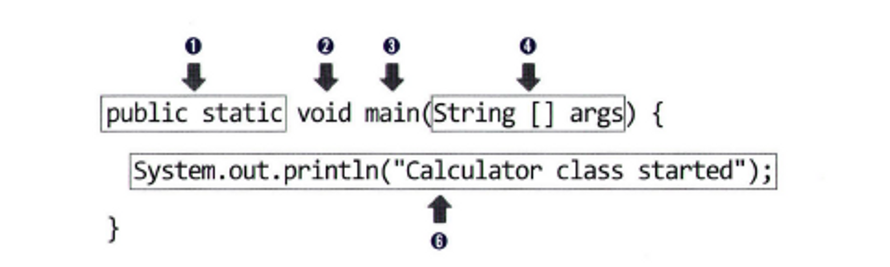

### 2장 Hello God Of Java

- 자바 컴파일 및 실행 절차
    - 소스(.java) → `컴파일러`→ 바이트 코드(.class) → `디스크` → 바이트 코드(.class) → `JVM` → 기계어 → `운영체제` → 실행
- 컴파일 : 프로그램 코드를 컴퓨터가 이해할 수 있도록 엮어주는 작업
- 배열 : 여러 데이터를 하나의 변수에 저장
- 주석 : 한 줄 주석(`//`), 블록 주석(`/* */`), 문서용 주석(`/** */`)
- (1) 제어자, (2) 리턴 타입, (3) 메소드 이름
- (4) 매개 변수 목록, (5) 예외 목록, (6) 메소드 내용

- 정리 문제
    - main() 메소드의 메소드 이름 앞에 어떤 예약어가 존재?
        - `void`
    - main() 메소드의 매개 변수에는 어떤 값이 존재?
        - `String[] args`
    - 클래스에 main() 메소드가 없으면 java 명령어로 해당 클래스를 수행 가능?
        - 불가능
    - System.out.println() 메소드의 용도?
        - 입력된 값을 출력하고 한 줄 개행
    - System.out.print() 메소드와 System.out.println() 메소드의 차이?
        - 개행 여부
    - `//`는 무엇을 하는데 사용하는 기호?
        - 한 줄 주석
    - `/* ~ */` 사이의 소스는 어떻게 되는지?
        - 블록 주석
    - 메소드를 선언할 때, 반드시 필요한 세가지?
        - 리턴 타입, 메소드 이름, 메소드 내용