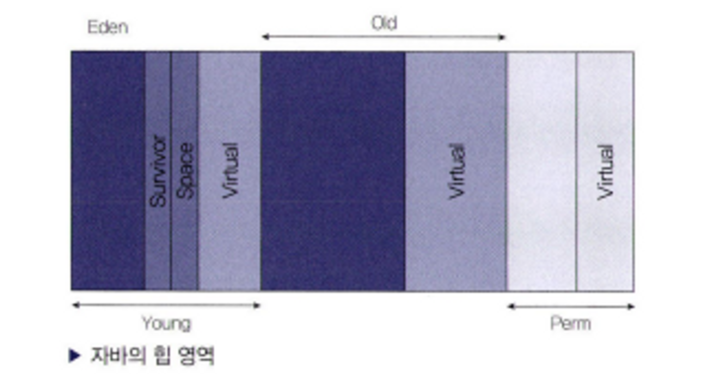

### 19장 이쯤에서 자바의 역사와 JVM에 대해서 알아보자

- 용어 정리
    - JDK (Java Development Kit), J2SE (Java 2 Standard Edition),  J2EE (Java 2 Enterprise Edition)
    - JRE (Java Runtime Environment): 자바를 실행할 수 있는 환경의 집합
- 자바 언어의 특징
    - 단순하고, 객체지향이며, 친숙해야 함
        - “단순함” 의미: 자바의 기본 컨셉을 배우는 것이 어렵지 않다
        - 자바는 처음 만들 때부터 객체지향으로 디자인되어 있음
        - 다형성, 캡슐화 등 객체지향 언어의 특징들을 지원할 수 있는 구조
        - 자바를 사용한다고 해서 무조건 객체지향적으로 개발되지는 않음
        - 자바로 개발할 때에는 처음부터 모든 것을 만들 필요가 없음
        - 개발하면서 필요한 여러 기능들은 이미 API를 통해 제공
        - C++보다 쉽고 빠르게 개발할 수 있다는 장점이 있음
    - 견고하고 보안상 안전
        - 컴파일할 때와 실행할 때 문법적 오류에 대한 체크
        - 메모리 관리 모델이 매우 단순, 포인터의 개념이 없음
        - 기본적으로 분산 환경에서 사용하기 위해 디자인 → 분산 환경에서 보안은 매우 중요한 부분 중에 하나
    - 아키텍처에 중립적이어야 하며 포터블해야 함
        - 매우 다양한 하드웨어 아키텍처에서 수행할 수 있도록 되어 있음
        - 아키텍처에 중립적인 바이트 코드를 생성
        - 자바의 버전만 동일하다면, 동일한 프로그램은 어떤 플랫폼에서도 실행 가능
        - 아키텍처 중립적 → 포터블한 시스템의 일부분
        - 프로그램은 어떤 플랫폼에서도 동일한 결과가 나오며, 하드웨어와 소프트웨어 아키텍처에 따른 데이터 타입의 호환성 문제가 발생하지 않음
    - 높은 성능을 제공
        - 실행 환경에서 최대한의 성능을 낼 수 있도록 되어 있음
        - 자동화된 가비지 컬렉터는 낮은 우선 순위의 쓰레드로 동작하기 때문에 보다 높은 성능을 낼 수 있음
        - 보다 빠른 성능을 위해서 네이티브한 언어로 작성한 부분을 자바에서 사용할 수 있도록 되어 있음
    - 인터프리터 언어이며, 쓰레드를 제공하고 동적인 언어
        - 자바 인터프리터는 자바 바이트 코드를 어떤 장비에서도 수행할 수 있도록 해줌
        - 개발 환경보다 빠른 환경 구축 가능
        - 멀티 쓰레드 환경을 제공하기 때문에, 동시에 여러 작업을 수행할 수 있음, 사용자에게 매우 빠른 사용 환경을 제공
        

- 자바 컴파일러는 컴파일 시, 매우 엄격한 정적인 점검을 수행, 실행 시에 동적으로 필요한 프로그램들을 링크 시킴
- JIT (Just-In-Time)
    - 어떤 메소드의 일부 혹은 전체 코드를 네이티브 코드로 변환하여 JVM에서 번역하지 않도록 함으로써 보다 빠른 성능을 제공, **동적 변환**
    - 사용하는 언어: `JAVA, .NET`
    - 만든 이유: 프로그램 실행을 보다 빠르게 하기 위해서, 명칭이 컴파일러이지만, 실행 시에 적용되는 기술
    - 인터프리트 방식과 정적 컴파일 방식을 혼합한 방식 → 변환 작업은 인터프리터에 의해서 지속적으로 수행되지만, 필요한 코드의 정보는 메모리에 올려두었다가 재사용
        - 프로그램을 실행할 때 마다 컴퓨터가 알아 들을 수 있는 언어로 변환하는 작업을 수행하는 **인터프리트 방식**
            - 간편 하기는 하지만 성능이 매우 느릴 수 있음
        - 실행하기 전에 컴퓨터가 이해할수 있는 언어로 변환하는 작업을 미리 진행하는 **정적 컴파일 방식**
    - `javac`라는 명령어를 수행한다는 것은 텍스트로 만든 java 파일을 어떤 OS에서도 수행될 수 있도록 바이트 코드라는 파일로 만든 것일 뿐!
        - 컴퓨터가 이해하도록 하려면 다시 변환 작업이 필요함 → 이 변환 작업을 JIT 컴파일러에서 진행
    - JVM → 기계 코드로 변환하는 부분을 JIT에서 수행
        - JIT를 사용하면 반복적으로 수행되는 코드는 매우 빠른 성능을 보임
        - 처음 시작할 때에는 변환 단계를 거쳐야 하므로 성능이 느림
        - 최근 CPU 성능이 많이 좋아지며, JDK 성능 개선도 많이 이루어져 성능이 느린 단점이 해소
- **NIO (New Input/Output): non-blocking, 1.4 이전 버전까지의  IO를 처리할 때 사용한 [java.io](http://java.io) 패키지에서 제공하는 기능의 단점을 보완하기 위한 것 → 성능은 비교할 수 없을 정도로 빠름**
- **HotSpot 클라이언트 컴파일러**: CPU 코어가 하나뿐인 사용자를 위해 만들어짐
    - 특징: 애플리케이션 시작 시간을 빠르게 하고, 적은 메모리를 점유하도록 하는 것
- **HotSpot 서버 컴파일러**: 코어가 많은 장비에서 애플리케이션을 돌리기 위해 만들어짐
    - 특징: 애플리케이션 수행 속도에 초점을 맞춤
- 기본적으로 자바가 시작 시에 알아서 클라이언트 장비인지, 서버 장비 인지 구분
    - 기준: 2개 이상의 물리적 프로세서, 2GB 이상의 물리적 메모리
    - OS에 따라 지정되는데, 윈도우는 기본적으로 지정해주지 않으면 클라이언트 컴파일러가 사용됨
- JVM (Java Virtual Machine)
    - 자바 프로그램이 수행되는 프로세스를 의미, java라는 명령어를 통해 애플리케이션이 수행되면, 이 JVM 위에서 애플리케이션이 동작
    - JVM에서 프로그램을 찾고 실행하는 일련의 작업이 진행
    - 메모리 관리를 알아서 진행 → GC (Garbage Collection)
    - 메모리를 효율적으로 사용하도록 개발하는 것은 매우 중요
- GC (Garbage Collection)
    - JVM 내에서 메모리를 관리
    - G1(Garbage First)라는 가비지 컬렉터를 제외한 나머지 JVM은 다음과 같이 영역을 나누어 Heap이라는 공간에 객체들을 관리
    - 가장 왼쪽에 있는 Young 영역에는 젊은 객체들이 존재하며, Old 영역에는 늙은 객체들이 자리, Perm 영역에는 클래스나 메소드에 대한 정보가 쌓임
    - Young 영역은 Eden과 두 개의 Survivor 영역으로 나뉘는데, 이중에서 객체를 생성하자마자 저장되는 장소는 Eden 영역
    - 메모리가 살아가는 과정 Minor GC (= Young GC)
        - Eden 영역에서 객체 생성
        - Eden 영역이 꽉 차면 살아있는 객체만 Survivor 영역으로 복사, 다시 Eden 영역을 채움
        - Survivor 영역이 꽉 차게 되면 다른 Survivor 영역으로 객체 복사, Eden 영역에 있는 객체들 중 살아있는 객체들도 다른 Survivor 영역으로 진행
            - Survivor 영역의 둘 중 하나는 반드시 비어 있어야 함
    - Major GC (= Full GC): 오래 살아있는 객체들은 Old 영역으로 이동, 지속적으로 이동하다가 Old 영역이 꽉 차면 GC가 발생
    - Young GC가 Full GC보다 빠름 → 일반적으로 더 작은 공간이 할당되어, 객체들을 처리하는 방식도 다름
    - GC 방식
        - Serial GC : WAS로 사용하는 JVM에서 사용하면 안됨 → 클라잉너트용 장비에 최적화된 GC이기 때문에 GC 속도가 매우 느려짐
        - Parallel Yong Generation Collector
        - Parallel Old Generation Collector
        - Concurrent Mark & Sweep Collector (CMS GC)
        - G1 (Garbage Firtst)
- 자바 버전이 올라간 이후에 바로 신버전으로 시스템을 변경하는 것을 권장하지 않음
- 운영될 서비스에서 사용할 언어라면 적어도 JDK의 Major 버전이 올라간 지 1년 정도 지난 후에 사용하는 것을 권장