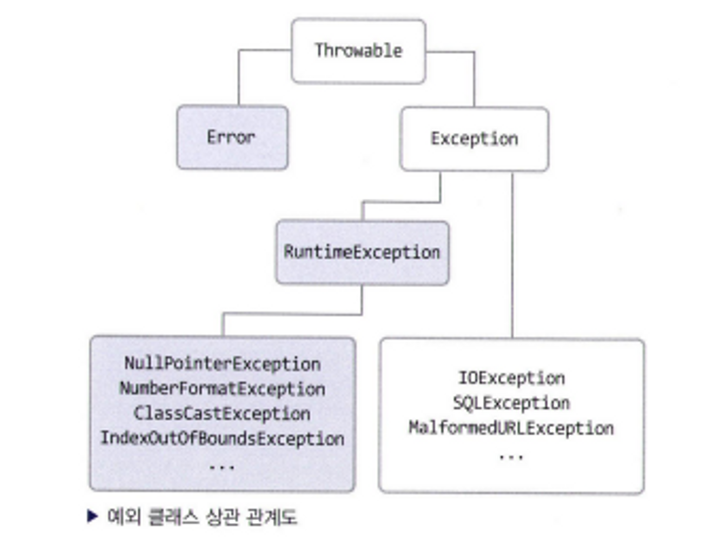

### 14장 다 배운 것 같지만, 예외라는 중요한 것이 있어요

- **예외 없는 규칙은 없다!**
- `Exception`: 예상하거나, 예상하지 못한 일이 발생하는 것을 미리 예견하고 안전장치는 하는 것
- `java.lang.Exception`: 모든 예외의 부모 클래스
- call stack trace: 프로그램 실행 중에 메소드 호출이 어떻게 이루어지는 지의 기록을 나타냄
- `try-catch 블록`
    - `try` 뒤에 중괄호로 예외가 발생하는 문장들을 묶고, `catch` 괄호 안에 예외가 발생했을 때의 처리, 1개 이상의 `catch`블록 가능
    - `try`블록 내에서 예외 발생 시, 예외가 발생한 줄 이후에 있는 `try`블록 내의 코드들은 수행되지 않음 → 이후 `catch` 블록에 있는 문장이 실행
    - `try`블록 내에서 예외가 발생하지 않으면 `catch` 내에 있는 코드는 실행되지 않음
    - `try`블록 내에서 선언한 변수를 `catch`에서 사용할 수 없음
    - `catch` 블록이 시작 되기 전에 소괄호에 예외의 종류를 명시, 예외와 관련이 있는 `catch` 블록을 찾아 실행, `catch` 블록의 순서를 따짐,
    - 먼저 선언한 catch 블록의 예외 클래스가 다음에 선언한 catch 블록의 부모에 속하면, 자식에 속하는 catch 블록은 절대 실행될 일이 없으므로 컴파일 되지 않음
    - 마지막 `catch` 블록은 `Exception` 클래스를 선언하여 예외들이 빠져나가지 않게 하는 것이 좋음
    - `**catch` 블록 중 발생한 예외와 관련있는 블록이 없을 경우, 예외가 발생되면서 해당 쓰레드 종료**
- `finally` 블록
    - 예외 발생 여부와 상관없이 실행
    - 코드의 중복을 피하기 위해 반드시 필요
- `Error`의 종류
    - `Error`
        - 자바 프로그램 밖에서 발생한 예외, 자바 프로그램이 제대로 동작하지 못하는 경우
        - `Exception` 클래스는 에러가 아님, `Exception`으로 끝나면 예외!
        - `Error`와 `Exception` 오류의 가장 큰 차이는 프로그램 안에서 발생,  밖에서 발생했는지 여부
        - `Error`: 프로세스에 영향을 줌, `Exception`: 쓰레드에만 영향을 줌
    - `RuntimeException`
        - 예외가 발생할 것을 미리 감지하지 못했을 때 발생
        - 컴파일 시에 체크하지 않게 때문에 `unchecked exception`이라고도 불림
        - `Runtime Exception`을 확장한 예외
    - `checkedException`
        - `error` 와 `unchecked exception`을 제외한 모든 예외
        - `Exception` 확장한 클래스

- `Exception`과 `Error` 클래스는 `Throwable` 클래스를 상속받아 처리
    - `Exception`과 `Error` 클래스는 성격이 다르지만, 동일한 이름의 메소드를 사용하여 처리 가능
    - `toString()` 메소드를 사용 시, `getMessage()` 보다 어떤 예외가 발생했는지 자세히 확인 가능, 더 자세한 메세지 필요 시 `printStackTrace()` 사용
- `throws`: 예외가 발생된 메소드를 호출한 메소드로 던짐
    - `throws` 구문으로 선언되어 있는 메소드를 호출한 메소드에서 `try-catch`로 호출 부분을 감싸야 함
        - 다른 방법으로는 호출한 메소드에서도 다시 `throws` 가능 → 이미 `throws`한 것을 다시 `throws`하는 방법은 좋은 습관이 아님
    - 메소드를 선언할 때 매개 변수 소괄호 뒤에 `throws`라는 예약어를 선언하면, 해당 메소드에서 선언한 예외가 발생했을 때 호출한 메소드로 예외 전달
    - `try` 블록 내에서 예외를 발생시킬 경우에는 `throw`예약어를 사용하여 예외 객체를 생성하거나, 생성된 객체를 명시
    - `throw`한 예외 클래스가 `catch`블록에 선언되어 있지 않거나 `throws`선언에 포함되어 있지 않으면 컴파일 에러 발생
    - `catch` 블록에서 예외를 `throw`할 경우에도 메소드 선언의 `throws` 구문에 해당 예외가 정의되어 있어야 함
    - **예외를 `throw`하는 이유는 해당 메소드에서 예외를 처리하지 못하는 상황이거나, 미처 처리하지 못한 예외가 있을 경우에 대비하기 위함**
- `Error`가 아닌 `Exception`을 처리하는 예외 클래스는 개발자가 생성 가능, `throwable`이나 직계 자손 클래스의 상속을 받아야함
- 개발 표준을 잡을 때, catch문 내에 어떻게 처리 할지 명시적으로 선언 필요
    - 임의의 예외 클래스 생성 시, 반드시 `try-catch`로 묶어줄 필요가 있을 경우에만 `Exception` 클래스를 확장
    - 일반적으로 실행시 예외를 처리할 수 있는 경우에는 `RuntimeException`클래스 확장이 좋음
    - `catch`문 내에 공백인 경우 예외 분석이 어려우므로 로그 처리와 같은 예외 처리를 해야 좋음
- 예외가 발생하지 않고, 실행 시에 발생할 확률이 높은 경우에는 런타임 예외로 만드는 것이 좋음
    - 예외를 던지는 메소드를 사용하더라도 `try-catch`로 묶지 않아도 컴파일시에 예외가 발생하지 않음
    - 예외가 발생할 경우 해당 클래스를 호출하는 다른 클래스에서 예외를 처리하도록 구조적 안전장치가 필요
    - `try-catch`로 묶지 않은 메소드를 호출하는 메소드에서 예외 처리하는 `try-catch`가 되어 있어야 함
- 정리 문제
    - 예외를 처리하기 위한 세 가지 블록에는 어떤 것이 있나요?
        - `try-catch-finally`
    - 1의 답 중에서 "여기에서 예외가 발생할 것이니 조심하세요"라고 선언하는 블룩은 어떤 블록인가요?
        - `try`
    - 1의 답 중에서 예외가 발생하든 안하든 얘는 반드시 실행되어야 됩니다. 라는 블록은 어떤 불복인 가요?
        - `finally`
    - 예외의 종류 세 가지는 각각 무엇인가요?
        - `Error, RuntimeException, checkedException`
    - 프로세스에 치명적인 영향을 주는 문제가 발생한 것을 무엇이라고 하나요?
        - `Error`
    - `try`나 `catch` 블록 내에서 예외를 발생시키는 키워드는 무엇인가요?
        - `throw`
    - 메소드 선언시 어떤 예외를 던질 수도 있다고 선언할 때 사용하는 키워드는 무엇인가요?
        - `throws`
    - 직접 예외를 만들 때 어떤 클래스의 상속을 받아서 만들어야만 하나요?
        - `throwable` 클래스