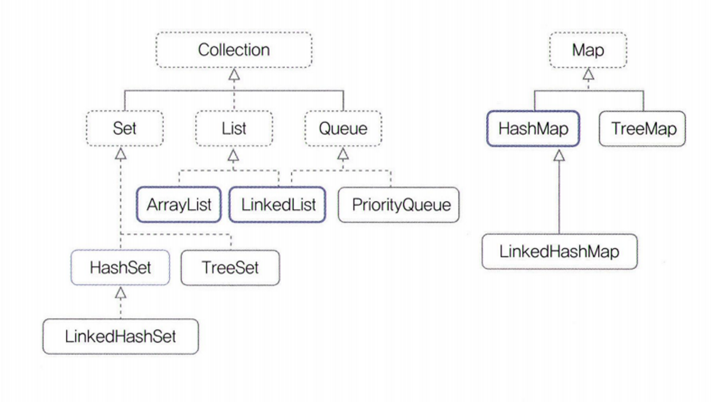

### 22장 자바랭 다음으로 많이 쓰는 애들은 컬렉션 - Part1(List)

- Collection
    - 목록성 데이터를 처리하는 자료 구조 (Data Structure)
    - 어떤 정보를 담는 것을 의미, 하나의 데이터가 아닌 여러 데이터를 담을 때 사용
    - 배열이 가장 기본적인 자료 구조, DTO도 자료를 담는 한 방식 중 하나
    - 배열은 그 크기가 정해져 있을 때 유용
- Collection 인터페이스에 `Iterable<E>` 인터페이스를 확장 함
    
    **→ 의미:** `Iterator` 인터페이스를 사용하는 데이터를 순차적으로 가져올 수 있음
    
- 컬렉션 관련 클래스의 선언부만 보아도 클래스가 `List`에 속하는지 `Set`에 속하는지 확인 가능
    - 개발하면서 상속 관계를 확인하는 습관을 들이는 것이 좋음
- 자바에서 데이터를 담는 자료 구조 분류
    - 순서가 있는  `List` 형
    - 순서가 중요하지 않은 `Set` 형
    - 먼저 들어온 것이 먼저 나가는 `Queue` 형
    - `key-value`로 저장되는 `Map` 형



- `List` 인터페이스는 `Collection` 인터페이스를 확장
    - `Collection`을 확장한 다른 인터페이스 차이점은 배열처럼 “순서”가 존재
    - `ArrayList`와 `Vector` 클래스의 사용법은 거의 동일, 기능도 거의 비슷, 확장 가능한 배열
    - `ArrayList`는 Thread safe 하지 않고, `Vector`는 Thread safe
    - `ArrayList` 클래스
        - 확장 가능한 배열, 배열처럼 사용하지만 대괄호는 사용하지 않고 메소드를 통해 객체를 넣고, 빼고, 조회
        - 중복된 데이터를 넣는 것이 가능
        - `Serializable, Cloneable, Iterable<E>, Collection<E> List<E> RandomAcess` 인터페이스 상속 받음
        - 생성자를 호출하는 부분에 따로 타입을 적지 않고 `<>`로만 사용해도 가능
        - 제네릭을 사용하면 컴파일 시점에 타입을 잘못 지정한 부분을 걸러낼 수 있음
        - `ArrayList` 객체 선언 시 매개 변수를 넣지 않으면 초기 크기는 10
        - 10개 이상의 데이터가 들어가면 크기를 늘이는 작업이 `ArrayList` 내부에서 자동으로 수행
        - `add(E e)`: 하나의 데이터를 저장하면 배열의 가장 끝에 데이터를 담음, 리턴되는 `boolean` 값은 추가 수행 여부
        - `List`를 구현한 클래스 사용 시, 위치를 잘못 지정하면 실행 시에 예외 발생
        - `ArrayList` 객체의 데이터 크기가 매개 변수로 넘어간 배열 객체의 크기보다 클 경우에는 매개 변수로 배열의 모든 값이 null로 채워 짐
        - `clear()` 메소드는 `ArrayList`의 데이터를 모두 삭제, `remove()` 메소드는 해당 위치의 데이터를 지우고 리턴
    - `Stack` 클래스
        - LIFO: Last In First Out, 나중에 들어온 값을 먼저 처리
        - `ArrayDeque`는 Thread safe 하지 않고, `Stack`는 Thread safe
        - `Stack` 클래스의 부모 클래스는 `Vector` 클래스
        - `Serializable, Cloneable, Iterable<E>, Collection<E> List<E> RandomAcess` 인터페이스 상속 받음
        - `peek()` 데이터 리턴, `pop()` 데이터 삭제 후 리턴
- `Collection`을 매개 변수로 갖는 생성자와 메소드가 존재
    
    **→ 이유:** 다양한 타입의 객체를 저장하여 사용 가능하기 때문에 사용
    
- 두 객체의 변수는 다르지만 하나의 객체가 변경되면 다른 이름의 변수를 갖는 객체의 내용도 바뀜
    - Shallow copy: 다른 객체에 원본 객체의 주소값만을 할당
    - Deep Copy: 객체의 모든 값을 복사하여 복제된 객체에 있는 값을 변경해도 원본에 영향이 없도록 할 때 사용
    - 하나의 `Collection` 관련 객체를 복사할 일이 있을 때에는 생성자를 사용하거나, `addAll()` 메소드를 사용하는 것을 권장
- `Collection`을 구현한 인터페이스는 size() 메소드를 통하여 들어가 있는 데이터의 개수를 확인
    - `배열.length`:  배열의 저장 공간 개수를 의미
    - `size()`: 들어가 있는 데이터 개수를 의미
- 정리 문제
    - Collection 인터페이스를 구현하는 대표적인 3개의 자료 구조에는 어떤 것들이 있나요?
        - `Set, List, Queue`
    - 배열과 같이 순서가 있는 목록형을 나타내는 대표 인터페이스는 무엇인가요?
        - `List`
    - `ArrayList`라는 클래스의 생성자 중 매개 변수가 없는 기본 생성자를 사용하면 기본적으로 몇 개의 저장 공간을 가지나요?
        - 10개
    - 만약 `ArrayList` 클래스의 저장 공간 개수를 처음부터 지정하려면 어떤 생성자를 사용하면 되나요?
        - `ArrayList(int 공간 개수);`
    - `ArrayList` 객체를 생성할 때 제네릭을 사용하는 이유는 무엇인가요?
        - 컴파일 시점에 타입을 잘못 지정한 부분을 걸러낼 수 있음
    - `ArrayList`에 데이터를 담는 메소드 이름 두 가지는 무엇인가요?
        - `add(), addAll()`
    - `Collection` 인터페이스를 구현한 클래스의 객체에서 사용할 수 있는 `for 루프`의 구조는 어떻게 되나요?
        
        ```java
        List<String> list = new ArrayList<>();
        for(String data:list) {
        	...
        }
        ```
        
    - `Collection` 인터페이스를 구현한 클래스의 객체 크기를 확인하는 메소드 이름은 무엇인가요?
        - `size()`
    - `ArrayList`에서 특정 위치에 있는 데이터를 확인하는 메소드는 무엇인가요?
        - `get()`
    - `ArrayList`에서 특정 위치에 있는 데이터를 삭제하는 메소드는 무엇인가요?
        - `remove()`
    - `ArrayList`에서 특정 위치에 있는 데이터를 수정하는 메소드는 무엇인가요?
        - `set()`
    - `java.util` 패키지에 있는 `stack`이라는 클래스는 어떤 클래스를 확장한 것인가요?
        - `Vector` 클래스를 상속
    - `stack` 클래스에서 데이터를 담는 메소드는 무엇인가요?
        - `push()`
    - `stack` 클래스에서 가장 위에 있는 데이터를 확인만 하는 메소드는 무엇인가요?
        - `peek()`
    - `stack` 클래스에서 가장 위에 있는 데이터를 삭제하고 리턴하는 메소드는 무엇인가요?
        - `pop()`